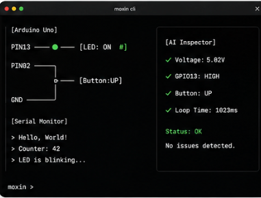

# CLI 形态设计

## 1. 总览

MoXin CLI 的四块面板:板形 + 接线、Serial Monitor、AI Inspector、`moxin >` 输入条。
每块独立演进,合起来构成 `moxin shell` 完整体验。

## 2. 四个面板

### `[Board]` 板形 + 引脚连线
渲染当前板子的引脚布局与组件连线。`PIN13 ●——[LED: ON #]` 形式表达"哪个引脚连了什么、当前状态是什么"。

### `[Serial Monitor]` 程序输出流
被仿真程序 `Serial.print*` 的输出实时滚动显示。

### `[AI Inspector]` 状态/诊断
把当前仿真器状态(电压、引脚、计数)结构化呈现。支持外接 LLM 渲染诊断建议；未连接模型时降级为纯状态展示。

### `moxin >` 输入条
始终在底部的命令输入入口，toast 形式回馈结果。

## 3. 设计决策

- **AI Inspector 走外接模型**：LLM API / MCP server 出来的结果，MoXin 不自训、不内置模型，只负责提供结构化状态 + 渲染外部模型回答。
- **接线靠命令驱动**：用户写 `wire pin13 -> led1.a`，自动布线，不手填坐标。

## 4. 待决问题

- Serial Monitor 是否需要染色 / 过滤 / 搜索。
- 自动布线算法选型（候选：dagre / graphviz / 手写最简栅格）。
